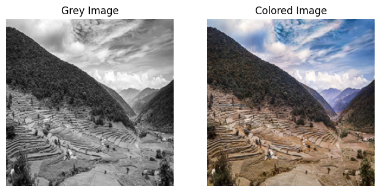

# Image Colorization with U-Net and GAN

This project demonstrates deep learning-based image colorization using a U-Net generator and a PatchGAN discriminator. The approach leverages both supervised pretraining and adversarial training to colorize grayscale images, with a focus on historical Nepali photographs.

---

## Features

- **Custom Dataset Support:** Easily adapt to any large and diverse image dataset.
- **Flexible Data Splitting:** Randomly selects and splits images for training and validation.
- **PyTorch Implementation:** All models and training loops are implemented in PyTorch.
- **U-Net Generator:** Includes both a classic U-Net and a ResNet18-based DynamicUnet.
- **PatchGAN Discriminator:** Judges realism at the local patch level for improved results.
- **GAN Losses:** Supports vanilla and least-squares GAN loss.
- **Pretraining:** Generator can be pretrained with L1 loss for faster and better convergence.
- **Visualization:** Utility functions for visualizing colorization results during training.
- **Checkpointing:** Saves model checkpoints after each epoch for easy recovery and analysis.

---

## Project Structure

- `Image_Colorization_with_U_Net_and_GAN_Tutorial.ipynb`: Main Jupyter notebook containing all code, explanations, and experiments.
- `model_checkpoints/`: Directory for saving model checkpoints and final trained models.
- `res18-unet.pt`: Pretrained weights for the ResNet18-based U-Net generator.

---

## Getting Started

### 1. Clone the Repository

```bash
git clone https://github.com/napsnu/Image-Colorization.git
cd Image-Colorization
```

### 2. Install Dependencies

> Recommended environment: Python 3.8+

```bash
pip install torch torchvision fastai==2.4 scikit-image matplotlib pillow tqdm
```

### 3. Prepare Your Dataset

- Place your images in a folder (e.g., `D:/new`)
- Update the `path` variable in the notebook to your dataset location

### 4. Run the Notebook

Open `Image_Colorization_with_U_Net_and_GAN_Tutorial.ipynb` in VS Code or Jupyter Notebook.

### 5. Training

- **Pretrain the Generator**  
  Run the pretraining cell to train the generator with L1 loss and save its weights.

- **Adversarial Training**  
  Load the pretrained generator and train the full GAN model for 10–20 epochs.

### 6. Visualization and Inference

Use provided utility functions to visualize results and predict colorizations for new grayscale images.

---

## Example Usage

```python
# Load pretrained generator and continue GAN training
net_G = build_res_unet(n_input=1, n_output=2, size=256)
net_G.load_state_dict(torch.load("res18-unet.pt", map_location=device))
model = MainModel(net_G=net_G)
train_model(model, train_dl, val_dl, 20, display_every=1500, save_dir="model_checkpoints")
```

---

## Results

The model achieves realistic colorization for common objects and scenes.

Pretraining the generator significantly improves convergence speed and final quality.

### 🔍 Sample Result

<p align="center">
  
</p>

---

## Tips

- For best results, use a diverse and high-quality dataset.
- Training time depends on hardware and dataset size (each epoch ~3–4 minutes on Colab GPU).
- You can easily adapt the notebook for other datasets or colorization tasks.

---

## Acknowledgements

- [fastai](https://www.fast.ai/)
- [PyTorch](https://pytorch.org/)
- [Image-to-Image Translation with Conditional Adversarial Networks](https://arxiv.org/abs/1611.07004)
